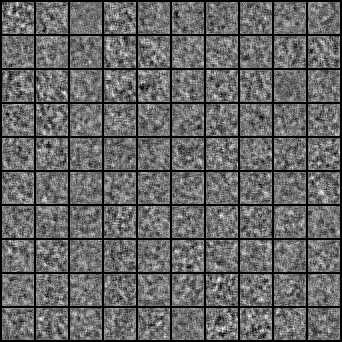

# PyTorch-GAN
[](LICENSE)
## About
[PyTorch](http://pytorch.org/) implementations (**Python 3.6.5 + PyTorch 0.4**) of [**Generative Adversarial Network (GAN)**](https://papers.nips.cc/paper/5423-generative-adversarial-nets.pdf) varieties.
Model architectures will not always mirror the ones proposed in the papers,
since I focus on getting the core ideas covered instead of getting
every layer configuration right.
Contributions and suggestions of GANs to implement are very welcomed.

This repo is on the basis of [eriklindernoren/PyTorch-GAN](https://github.com/eriklindernoren/PyTorch-GAN). Thanks to [_@eriklindernoren_](https://github.com/eriklindernoren).

## Table of Contents
- [PyTorch-GAN](#pytorch-gan)
  * [About](#about)
  * [Table of Contents](#table-of-contents)
  * [Installation](#installation)
  * [Implementations](#implementations)
    + [Auxiliary Classifier GAN](#auxiliary-classifier-gan)

## Installation
```bash
git clone https://github.com/lidq92/PyTorch-GAN
cd PyTorch-GAN/
# source activate ~/anaconda3/envs/research/ # conda env
# source research-envs/bin/activate # or using virtualenv with python3
pip install -r requirements.txt
```

## Implementations   
### Auxiliary Classifier GAN
[_Augustus Odena_](https://dblp.uni-trier.de/pers/hd/o/Odena:Augustus), [_Christopher Olah_](https://dblp.uni-trier.de/pers/hd/o/Olah:Chris), [_Jonathon Shlens_](https://dblp.uni-trier.de/pers/hd/s/Shlens:Jonathon). [Conditional Image Synthesis with Auxiliary Classifier GANs](http://proceedings.mlr.press/v70/odena17a/odena17a.pdf), [ICML 2017](https://icml.cc/Conferences/2017/)


#### Abstract
In this paper we introduce new methods for the improved training of generative adversarial
networks (GANs) for image synthesis. We construct a variant of GANs employing label
conditioning that results in 128 × 128 resolution image samples exhibiting global coherence.
We expand on previous work for image quality assessment to provide two new analyses for
assessing the discriminability and diversity of samples from class-conditional image
synthesis models. These analyses demonstrate that high resolution samples provide class
information not present in low resolution samples. Across 1000 ImageNet classes, 128 × 128
samples are more than twice as discriminable as artificially resized 32 × 32 samples. In
addition, 84.7% of the classes have samples exhibiting diversity comparable to real
ImageNet data.

#### Run Example
```bash
cd implementations/acgan/
python acgan.py --help
python acgan.py
# tensorboard --logs="logs" --port=6006
```

<p align="center">
    
</p>
